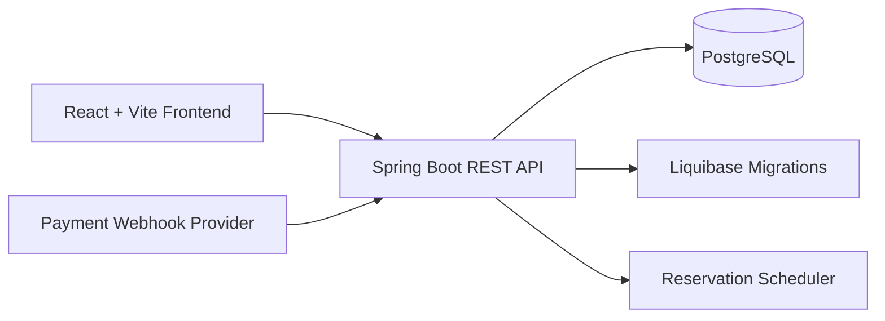
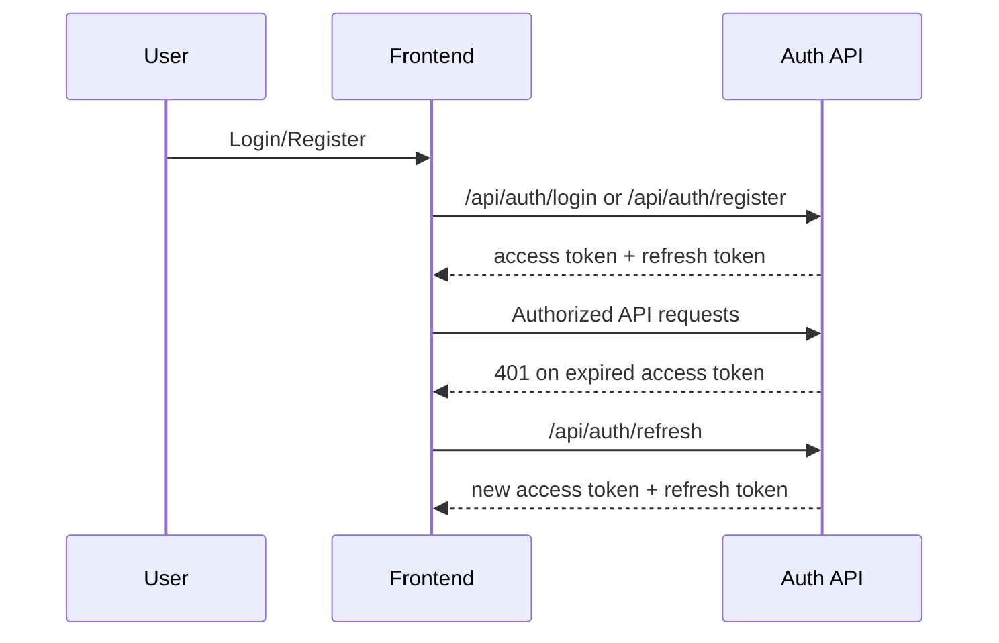
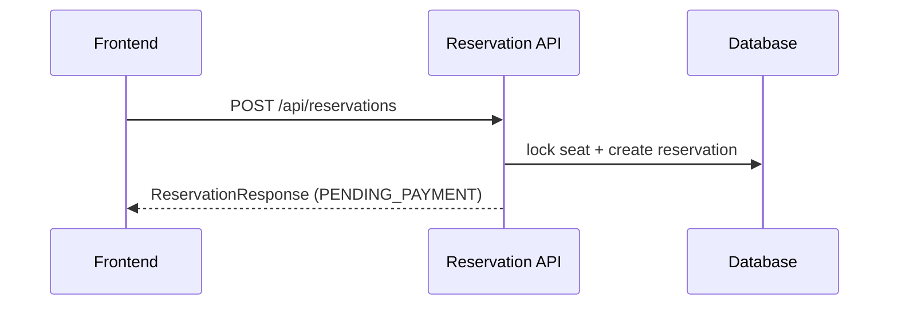
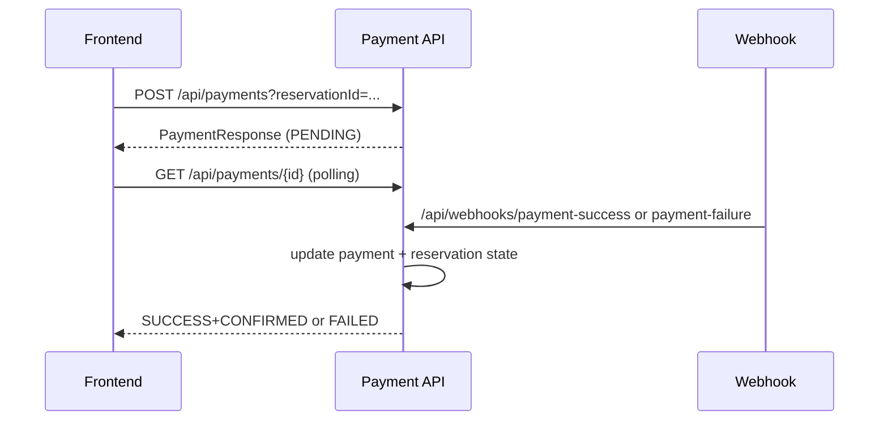
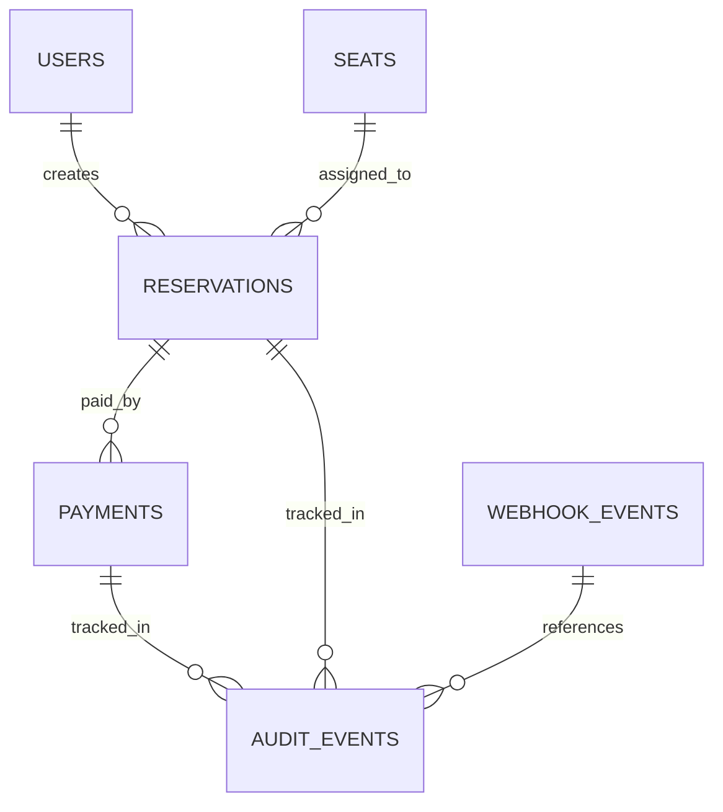

# Seat Reservation Platform

## Project Overview

Seat Reservation Platform is a full-stack application for authenticated seat booking with payment processing, reservation expiration, and concurrency-safe state transitions.

## Architecture



## Technology Stack

| Layer | Technology |
|---|---|
| Backend | Java 21, Spring Boot 3.3, Spring Security, Spring Data JPA, Hibernate |
| Database | PostgreSQL, Liquibase |
| Frontend | React, Vite, React Router, Axios |
| Testing | JUnit 5, MockMvc, Vitest, React Testing Library |
| Infrastructure | Podman, Podman Compose |

## Features

- JWT authentication (register, login, refresh token, `/api/auth/me`)
- Seat availability listing
- Reservation lifecycle (pending payment, confirmed, expired)
- Payment initiation, completion, idempotent initiation
- Webhook-driven payment status updates
- Reservation expiration scheduler
- Concurrency protections (pessimistic + optimistic locking)
- Standardized API error payload

## Authentication Flow



## Reservation Flow



## Payment Flow



## Expiration Scheduler

- `ReservationScheduler` periodically scans for expired `PENDING_PAYMENT` reservations.
- Expired reservations are marked `EXPIRED` and seats are released back to `AVAILABLE`.

## Concurrency Handling

- Pessimistic lock: `SeatRepository.findByIdForUpdate`
- Optimistic lock: `@Version` on Seat/Reservation/Payment
- Conflict responses mapped to HTTP `409`

## Optimistic Locking

`@Version` columns are maintained via Liquibase (`010-add-version-columns.xml`) and verified by integration tests.

## Database Schema

Core tables:

- `users`
- `seats`
- `reservations`
- `payments`
- `webhook_events`
- `audit_events`

### ER Diagram



## API Documentation

- Swagger UI: `http://localhost:8080/swagger-ui/index.html`
- Static docs:
  - `frontend/api-docs.yaml`
  - `frontend/api-docs.json`

## Project Structure

```text
seat-reservation/
├── backend/
│   ├── src/main/java/com/linkz/reservation/
│   ├── src/main/resources/db/changelog/
│   └── run-backend.sh
├── frontend/
│   ├── src/
│   ├── api-docs.yaml
│   ├── api-docs.json
│   └── run-frontend.sh
├── run-all.sh
└── .github/workflows/build.yml
```

## Running Locally

```bash
chmod +x run-all.sh
./run-all.sh
```

## Running Tests

Backend:

```bash
cd backend
./gradlew --no-daemon clean test
```

Frontend:

```bash
cd frontend
npm test -- --run
npm run build
```

## Running with Podman

Backend script:

```bash
cd backend
./run-backend.sh --with-tests --with-build --verify
```

Frontend script:

```bash
cd frontend
./run-frontend.sh --with-tests --with-build --background --verify
```

## Known Limitations

- Development payment simulation endpoints are profile-gated (`dev` only).
- Webhook behavior still assumes event payload shape `{ eventId, providerReference }`.
- UI screenshots are not committed in this repository yet.

## Future Improvements

- Add CI matrix for multiple JDK/Node versions.
- Publish OpenAPI docs automatically from CI.
- Add dedicated end-to-end browser tests.

