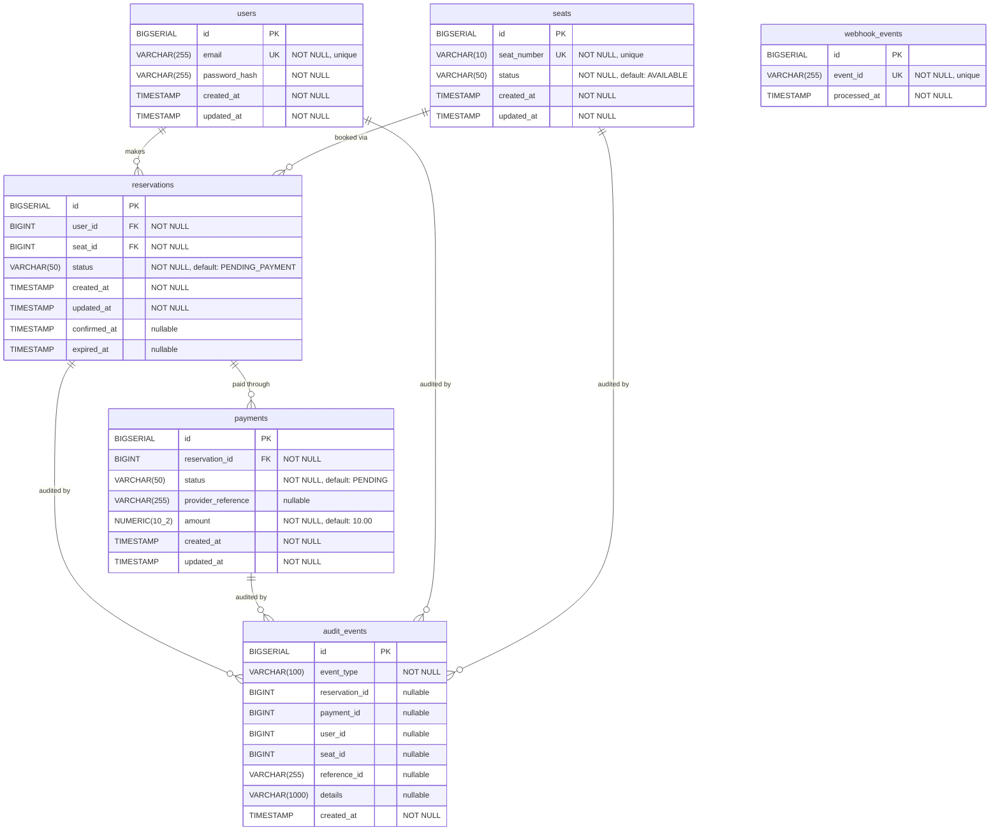

# Seat Reservation Platform

Secure seat reservation backend with JWT authentication, concurrency protection, and payment webhook handling.

## Prerequisites

- Java 21
- Gradle
- Podman

## Build

```bash
./gradlew clean build
podman build -t seat-reservation-api:latest .
```

## Run

```bash
podman compose up -d
```

## Verify

```bash
curl http://localhost:8080/actuator/health
```

Expected response:
```json
{
  "status": "UP"
}
```

## Stop

```bash
podman compose down
```

## API Endpoints

Main Swagger UI: http://localhost:8080/swagger-ui.html
Redirects to: http://localhost:8080/swagger-ui/index.html
OpenAPI JSON Documentation: http://localhost:8080/v3/api-docs
Health Check: http://localhost:8080/actuator/health

## Demo User

Email: test@example.com  
Password: password123

## Seed Data

The application includes production-quality seed data generator with 16,500+ records ensuring strict referential integrity and business rule compliance.

### Quick Start

```bash
# Seed data automatically loads on first run
./gradlew clean build
podman compose up -d

# Verify seed data integrity
./scripts/verify_seed_data.sh
```

### Dataset Overview

| Table | Records | Purpose |
|-------|---------|---------|
| users | 1,000 | User accounts |
| seats | 500 | Physical seats (150 AVAILABLE, 100 RESERVED, 200 BOOKED, 50 MAINTENANCE) |
| reservations | 2,000 | Bookings (400 PENDING_PAYMENT, 1,300 CONFIRMED, 300 EXPIRED) |
| payments | 2,000 | Linked 1:1 to reservations with status mapping |
| webhook_events | 1,000 | Payment provider webhook idempotency store |
| audit_events | 10,000 | Immutable domain event log (8 event types) |

### Key Guarantees

✓ **Referential integrity**: No orphan records  
✓ **Status consistency**: Payment status matches reservation status (CONFIRMED→SUCCESS, PENDING_PAYMENT→PENDING, EXPIRED→FAILED)  
✓ **Timestamp ordering**: Proper temporal sequences  
✓ **Unique constraints**: No duplicates  
✓ **Business rules**: MAINTENANCE seats never receive active reservations  
✓ **Audit completeness**: Every lifecycle event is tracked

### Documentation

- **[Quick Start Guide](scripts/QUICK_START_SEED_DATA.md)** — How to load and verify seed data
- **[Complete Specification](scripts/SEED_DATA_README.md)** — Detailed requirements and generation strategy
- **[Verification Script](scripts/verify_seed_data.sh)** — Automated integrity checks

## Database Schema (ERD)



### Table Summary

| Table | Description |
|---|---|
| `users` | Registered users with hashed passwords |
| `seats` | Physical seats with availability status (`AVAILABLE`, etc.) |
| `reservations` | Seat reservations linking a user to a seat (`PENDING_PAYMENT`, `CONFIRMED`, `EXPIRED`, etc.) |
| `payments` | Payment records for a reservation (`PENDING`, `COMPLETED`, `FAILED`, etc.) |
| `webhook_events` | Idempotency store for processed payment provider webhook events |
| `audit_events` | Immutable audit log tracking all domain events across reservations, payments, users, and seats |

### Key Indexes

| Table | Index | Columns |
|---|---|---|
| `users` | `idx_users_email` | `email` (unique) |
| `seats` | `idx_seats_seat_number` | `seat_number` (unique) |
| `seats` | `idx_seats_status` | `status` |
| `reservations` | `idx_reservations_user_id` | `user_id` |
| `reservations` | `idx_reservations_seat_id` | `seat_id` |
| `reservations` | `idx_reservations_status` | `status` |
| `reservations` | `idx_reservations_created_at` | `created_at` |
| `reservations` | `idx_reservations_confirmed_at` | `confirmed_at` |
| `reservations` | `idx_reservations_expired_at` | `expired_at` |
| `reservations` | `idx_reservations_status_created_at` | `status`, `created_at` |
| `payments` | `idx_payments_reservation_id` | `reservation_id` |
| `payments` | `idx_payments_status` | `status` |
| `payments` | `idx_payments_provider_reference` | `provider_reference` |
| `webhook_events` | `idx_webhook_events_event_id` | `event_id` (unique) |
| `audit_events` | `idx_audit_events_event_type` | `event_type` |
| `audit_events` | `idx_audit_events_created_at` | `created_at` |
| `audit_events` | `idx_audit_events_reservation_id` | `reservation_id` |
| `audit_events` | `idx_audit_events_payment_id` | `payment_id` |

## Technology Stack

- Java 21, Spring Boot 3.5
- PostgreSQL 17
- JWT Authentication
- Liquibase Migrations
- Podman
